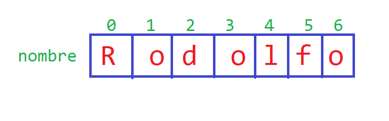

# Clase 10
## Cadenas como Estructuras de Datos
Las cadenas, tambien conocidas como **strings** son llamadas así, porque almacenan una *cadena de caracteres* en su interior. <br>
Cuando declaramos una cadena como en la siguiente linea:
```cpp
string nombre="Rodolfo";
```
Lo que en realidad se esta guardando en la memoria es lo siguiente:
 <br>
Un *string* es similar a un *arreglo de caracteres*, solo que tiene aún mas caracteristicas, las cuales seran analizadas en la Clase 11.
### Ejemplo 1
En el siguiente ejemplo se muestra como saber la cantidad de caracteres tiene una palabra haciendo uso de la función *.size()* de un string.
```cpp
int main(){
	string palabra; // Creamos el string
	cin>>palabra; // Pedimos el string
	int tam = palabra.size(); // Obtenemos su tamaño
	cout<<"La palabra ingresada tiene "<<tam<<" letras";
}
```
### Ejemplo 2
En el siguiente ejemplo se muestra como imprimir todas las letras de una palabra separadas por un espacio.
```cpp
int main(){
	string palabra; // Creamos el string
	cin>>palabra; // Pedimos el string
	int tam = palabra.size(); // Obtenemos su tamaño

	// Recorremos todas las letras
	for(int i=0;i<tam;i++){
		cout<<palabra[i]<<" ";
	}
	cout<<endl;
}
```
### Ejemplo 3
El siguiente ejemplo muestra un programa que **cuenta las vocales que tiene una palabra ingresada por el usuario**
```cpp
int main(){
	string palabra; // Creamos el string
	while(cin>>palabra){ // Pedimos el string
		int tam = palabra.size(); // Obtenemos su tamaño
		// Contamos las vocales
		int cant_vocales = 0; // En esta variable se contaran las vocales
		for(int i=0;i<tam;i++){// Recorremos todas las letras
			char letra=palabra[i];
			if(letra=='a' or letra=='e' or letra=='i' or letra=='o' or letra=='u'){
				cant_vocales = cant_vocales + 1;
			}
		}
		cout<<"La palabra tiene "<<cant_vocales<<" vocales"<<endl;
	}
}
```
### Ejercicio 1
Debes realizar un programa que cuente cuantas **consonantes** tiene una palabra. Debes resolver el siguiente ejercicio en el juez virtual. [CONSONANTES](https://jv.umsa.bo/problem.php?id=1959).