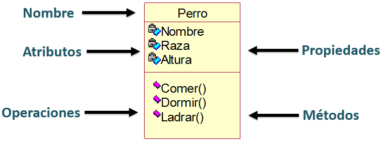

# Clase 11
## Ejemplos y Ejercicios de Strings
### Ejemplo 1
El siguiente ejemplo muestra un programa que **cuenta las vocales que tiene una palabra ingresada por el usuario**
```cpp
int main(){
	string palabra; // Creamos el string
	while(cin>>palabra){ // Pedimos el string
		int tam = palabra.size(); // Obtenemos su tamaño
		// Contamos las vocales
		int cant_vocales = 0; // En esta variable se contaran las vocales
		for(int i=0;i<tam;i++){// Recorremos todas las letras
			char letra=palabra[i];
			if(letra=='a' or letra=='e' or letra=='i' or letra=='o' or letra=='u'){
				cant_vocales = cant_vocales + 1;
			}
		}
		cout<<"La palabra tiene "<<cant_vocales<<" vocales"<<endl;
	}
}
```
### Ejercicio 1
Debes realizar un programa que cuente cuantas **consonantes** tiene una palabra. Debes resolver el siguiente ejercicio en el juez virtual. [CONSONANTES](https://jv.umsa.bo/problem.php?id=1959).
### Ejemplo 2
El siguiente ejemplo muestra como dar la vuelta una palabra.
```cpp
int main(){
	string palabra;
	while(cin>>palabra){
		string al_reves = ""; // En esta variable guardaremos la palabra al reves

		// Recorremos la palabra desde el final hasta el inicio
		for(int i=palabra.size()-1;i>=0;i--){
			// Proceso para poner la palabra al reves
			al_reves = al_reves + palabra[i];
		}
		cout<<"La palabra al reves es "<<al_reves<<endl;
	}
	return 0;
}
```
### Ejercicio 2
**Debes realizar un programa que indique si una palabra es o no palindrome**. Una palabra es palindrome si se lee igual leida de izquierda a derecha y de derecha a izquierda. Debes resolver el siguiente ejercicio en el juez virtual. [PALINDROMES](https://jv.umsa.bo/problem.php?id=1960).
## String como una clase
Desde la primera clase has notado que los strings no son iguales a los demas tipos de datos. Es que en realidad los strings son una **clase**. <br>
Las clases son estructuras de programación que nos permiten representar una entidad de la vida real. Como por ejemplo en la imagen se muestra como seria la *Clase Perro*

>Las clases se caracterizan por tener **propiedades** y **metodos**, las propiedas nos muestran que es lo que tiene una clase y los métodos nos muestran que es lo que puede hacer la clase.
### Constructores
Los constructores son formas de crear una *instancia* de una clase. En el caso de los strings estos se pueden crear de las siguientes formas. 
```cpp
string s; // string vacio
string t="pepe"; // string con contenido pepe
string r=(5,'B'); // string con contenido BBBBB
```
### Tamaño
Para obtener el tamaño de un string se utiliza el método **.size()**.
```cpp
string s="juanito";
string t="";
cout<<s.size()<<endl; // Imprimira 7
cout<<t.size()<<endl; // Imprimira 0
```
### Búsqueda
Buscar en un string es siempre útil para esto se ha desarrollado el método **.find()** que nos ayuda a buscar un estring dentro de otro.
```cpp
string frase = "bla ble bli blo blu";
int pos = frase.find("bli"); // pos es igual a la posición donde se encontró bli, en este caso 8
int pos2 = frase.find("Bla"); // pos es igual a -1 porque no encontro la palabra
int pos3 = frase.find('b'); // pos sera igual a 0 porque la primera letra b esta ahi.
```
### Subcadenas
Las **subcadenas** no son mas que pedazos de un string, en muchas ocasiones es muy útil tener al capacidad de cortar un string en uno mas pequeño. La sintaxis de este método llamado **.substr()** es la siguiente.
``string.substr(int pos,int largo);``
```cpp
string frase = "Creadores Digitales 2020";
cout<<frase.substr(10,9)<<endl; // Imprimira Digitales
cout<<frase.substr(10)<<endl; // Imprimira Digitales 2020
```
____
Mas información acerca de este tema puede ser visto en [minidosis.org](http://www.minidosis.org/#/temas/Cpp.Strings) o en la [documentación oficial de C++](http://cplusplus.com/reference/string/string/?kw=string)