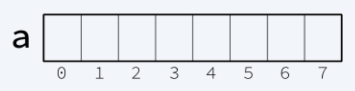

# Clase 2 
## Estructuras de Datos 
### ¿Qué es una estructura de datos?
- Es una forma de organizar un conjunto de datos.
- Una estructura de datos nos facilita la manipulación de datos.
- Cada estructura tiene sus propias ventajas y desventajas
- Elegir una estructura adecuadamente puede ser un parte crucial de la resolucion de un problema.

### Clasificación de las Estructuras de Datos
#### Estructuras de Datos Estáticas
+ Se caracterizan por no poder cambiar su tamaño a lo largo del programa.
+ El tamaño se define una vez y este no puede cambiar.
+ Los ejemplos mas usuales son:
    + Arreglos
    + Matrices

#### Estructuras de Datos Dinámicas
+ Se caracterizan por poder cambiar su tamaño a lo largo del programa.
+ Son comunmente implementadas mediante librerias STL.
+ Los ejemplos mas usuales son:
    + Vectores
    + Mapas
    + Conjuntos
    + Colas
    + Pilas
__________
## Arreglos
Los **arreglos** son una colección de variables del mismo tipo, accesibles a través de un índice. Llamaremos **casilla** a cualquiera de las variables individuales que componen un arreglo.
Un arreglo se puede ver como
