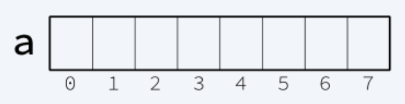
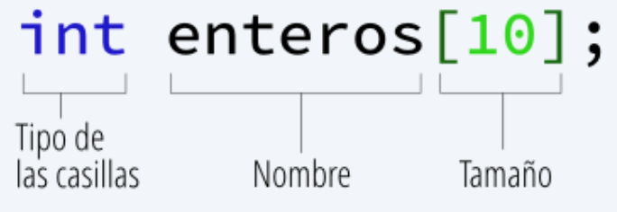

# Clase 3
## Arreglos
### Definición
Los **arreglos** son una colección de variables del mismo tipo, accesibles a través de un índice. Llamaremos **casilla** a cualquiera de las variables individuales que componen un arreglo.
Un arreglo se puede ver como <br>

>El **arreglo** de la imagen se llama **a** y agrupa a **8** variables(casillas), que comienzan a numerarse del 0 al 7

### Declaración


```cpp
#include <iostream>
using namespace std;
int main(){
	int enteros[10]; //Declara un arreglo de tamaño 10 de tipo entero
	float numeros[4]; //Declara un arreglo de tamaño 4 de tipo flotante
	int tam;
	cin>>tam;
	int datos[tam]; //Declarara un arreglo de tamaño tam de tipo entero
}
```

### Como Usar Arreglos
```cpp
#include <iostream>
using namespace std;
int main(){
	int enteros[10]; //Declara un arreglo de tamaño 10 de tipo entero
	// Al inicio los arreglos comienzan sin valores en sus casillas
	//Para acceder a una casilla hacemos
	enteros[0] = 8; // Ahora la casilla 0 del arreglo tendra el valor de 8
	enteros[1] = -7; // Ahora la casilla 1 del arreglo tendra el valor de -7
	cout<<enteros[0]<<endl; 
}
```

### Ejemplo 1 - Impresión y Recorrido de un Arreglo
El siguiente programa realiza el recorrido e impresión de un arreglo de tamaño 7
```cpp
#include <iostream>
using namespace std;
int main(){
	int N[7]; // Arreglo de tamaño 7
	//Rellenamos el arreglo, esta es una forma no optima de realizar el rellenado, tambien toma en cuenta que puedes utilizar un for para llenarlo.
	N[0] = 4;
	N[1] = 6;
	N[2] = -1;
	N[3] = 0;
	N[4] = 9;
	N[5] = -14;
	N[6] = 10;
	//Recorremos e imprimimos el arreglo
	for(int i=0;i<7;i++){//El final siempre debe ser el tamaño del arreglo
		cout<<"N["<<i<<"] = "<<N[i]<<endl;
	}
}
```

