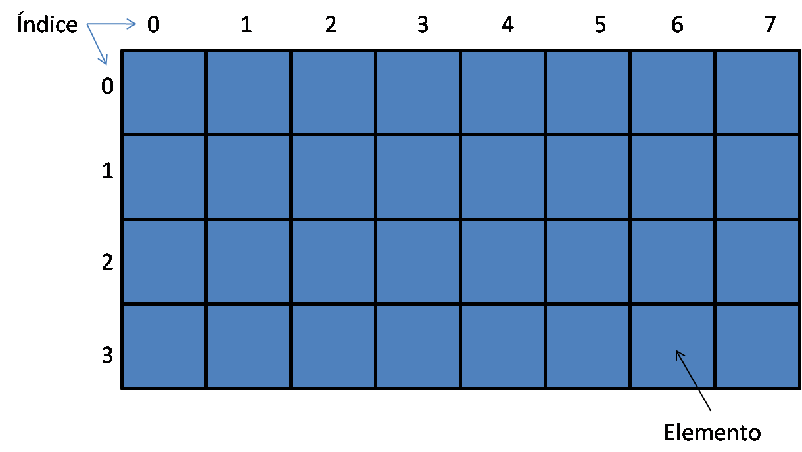
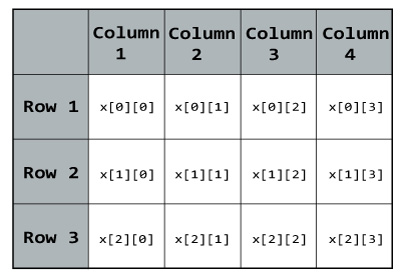

# Clase 8
### ¿Qué es una matriz?
Una matriz es un arreglo de 2 dimensiones. Lo cual genera una estructura en forma de tabla como en la imagen. 
 
Una matriz a diferencia de un arreglo tiene 2 índices en lugar de 1, como se muestra en la figura. Cabe tambien recalcar que cada una de las casillas es un elemento de la matriz.  
Recuerda que puedes realizar arreglos de la cantidad de dimensiones que desees, en la imagen inferior se muestra como se veria una matriz de 3 dimensiones.  
 
### Posiciones en una matriz
La imagen muestra las posiciones que tiene una matriz. 
 
### Ejemplo 1
### Ejercicio 1
### Ejemplo 2
### Ejercicio 2
