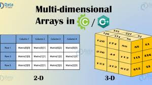

# Clase 8
### ¿Qué es una matriz?
Una matriz es un arreglo de 2 dimensiones. Lo cual genera una estructura en forma de tabla como en la imagen.<br>
<br>
Una matriz a diferencia de un arreglo tiene 2 índices en lugar de 1, como se muestra en la figura. Cabe tambien recalcar que cada una de las casillas es un elemento de la matriz. <br>
Recuerda que puedes realizar arreglos de la cantidad de dimensiones que desees, en la imagen inferior se muestra como se veria una matriz de 3 dimensiones. <br>
<br>
### Posiciones en una matriz
La imagen muestra las posiciones que tiene una matriz.<br>
<br>
Las posiciones se acceden primero por la *fila* y luego por la *columna*. Las filas son horizontales y las columnas verticales.<br>
### Ejemplo 1
El ejemplo mostrado a continuación muestra como llenar una matriz de 4 filas y 8 columnas con dos ciclos for, en la que el contenido de la matriz es de 0s.
```cpp
int main(){
	int matriz[4][8]; // 4 filas y 8 columnas
	//Recorremos la matriz
	for(int i=0;i<4;i++){//Primer ciclo recorre las filas
		for(int j=0;j<8;j++){//Segundo ciclo recorre las columnas
			matriz[i][j]=0;
		}
	}
}
```
### Ejercicio 1
Llenar una matriz de 3x4 como en la imagen. <br>

### Ejemplo 2
El siguiente ejemplo muestra una matriz de 4 filas y 8 columnas llenada con valores del 0 al 31, y despues muestra su impresión.<br>
```cpp
int main(){
	int matriz[4][8];
	// Llenamos la matriz
	for(int i=0;i<4;i++){// Recorremos las filas
		for(int j=0;j<8;j++){// Recorremos las columnas
			matriz[i][j]=i*8+j;
		}
	}
	// Imprimimos la matriz
	for(int i=0;i<4;i++){
		for(int j=0;j<8;j++){
			cout<<matriz[i][j]<<" ";// Imprimimos cada elemento.
		}
		cout<<endl;// Imprimos un fin de linea para cada nueva fila
	}
}
```
### Ejercicio 2
Llenar una matriz de 3x4 como en la imagen e imprimirla <br>

