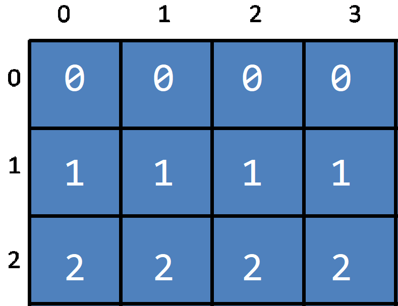
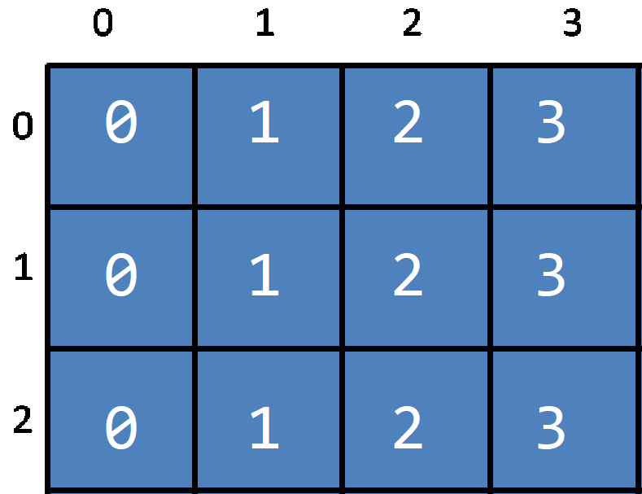

# Clase 9
### Ejemplo 1
El ejemplo mostrado a continuación muestra como llenar una matriz de 4 filas y 8 columnas con dos ciclos for, en la que el contenido de la matriz es de 0s.
```cpp
int main(){
	int matriz[4][8]; // 4 filas y 8 columnas
	//Recorremos la matriz
	for(int i=0;i<4;i++){//Primer ciclo recorre las filas
		for(int j=0;j<8;j++){//Segundo ciclo recorre las columnas
			matriz[i][j]=0;
		}
	}
}
```
### Ejercicio 1
Llenar una matriz de 3x4 como en la imagen. <br>

### Ejemplo 2
El siguiente ejemplo muestra una matriz de 4 filas y 8 columnas llenada con valores del 0 al 31, y despues muestra su impresión.<br>
```cpp
int main(){
	int matriz[4][8];
	// Llenamos la matriz
	for(int i=0;i<4;i++){// Recorremos las filas
		for(int j=0;j<8;j++){// Recorremos las columnas
			matriz[i][j]=i*8+j;
		}
	}
	// Imprimimos la matriz
	for(int i=0;i<4;i++){
		for(int j=0;j<8;j++){
			cout<<matriz[i][j]<<" ";// Imprimimos cada elemento.
		}
		cout<<endl;// Imprimos un fin de linea para cada nueva fila
	}
}
```
### Ejercicio 2
Llenar una matriz de 3x4 como en la imagen e imprimirla <br>


## Petición de una matriz (Mapa de Caracteres)
```cpp
int main(){
	int num_filas, num_columnas;
	cin>>num_filas>>num_columnas; // Pedimos el numero de filas y columnas.
	char mapa[num_filas][num_columnas]; // Creamos la matriz de caracteres

	// Peticion de los caracteres que tendra la matriz
	for(int i=0;i<num_filas;i++){// Filas
		for(int j=0;j<num_columnas;j++){// Columnas
			cin>>mapa[i][j];
		}
	}
}
```
## Petición de una matriz (Matriz Numérica)
```cpp
int main(){
	int num_filas, num_columnas;
	cin>>num_filas>>num_columnas; // Pedimos el numero de filas y columnas.
	int matriz[num_filas][num_columnas]; // Creamos la matriz de numeros

	// Peticion de los numeros que tendra la matriz
	for(int i=0;i<num_filas;i++){// Filas
		for(int j=0;j<num_columnas;j++){// Columnas
			cin>>matriz[i][j];
		}
	}
}
```